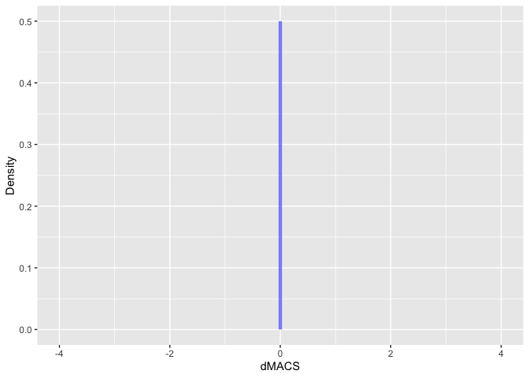
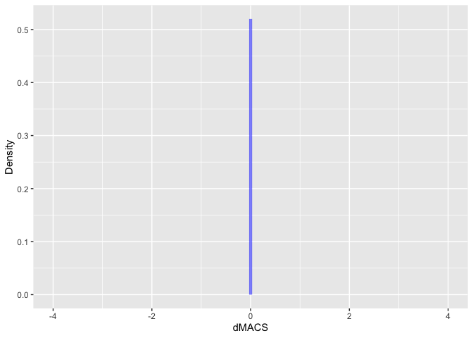
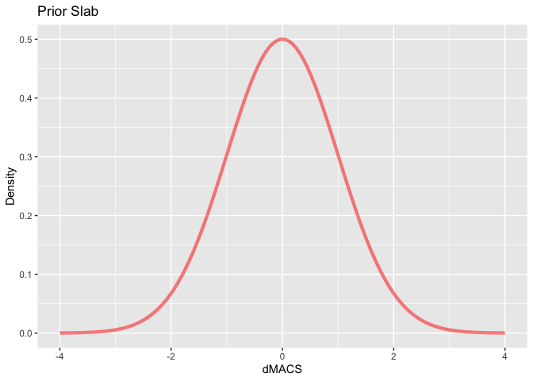
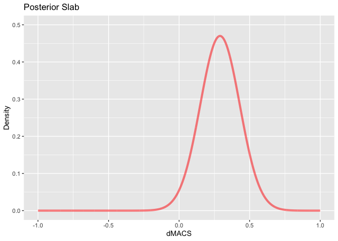
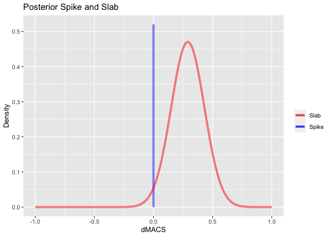

Portfolio-3
================
Conor Lacey
2023-02-26

``` r
suppressWarnings(library(tidyverse))
```

    ## ── Attaching packages ─────────────────────────────────────── tidyverse 1.3.2 ──
    ## ✔ ggplot2 3.4.0     ✔ purrr   0.3.4
    ## ✔ tibble  3.1.8     ✔ dplyr   1.0.8
    ## ✔ tidyr   1.1.4     ✔ stringr 1.4.0
    ## ✔ readr   2.1.3     ✔ forcats 0.5.1
    ## ── Conflicts ────────────────────────────────────────── tidyverse_conflicts() ──
    ## ✖ dplyr::filter() masks stats::filter()
    ## ✖ dplyr::lag()    masks stats::lag()

### Introduction

This portfolio is a continuation of my previous one. In this one I want
to make graphics that show how exactly the prior and posterior
distribution should look for the spike and the slab.

### The Spike

The spike’s prior is simply the probability of the effect (in the case
of my thesis, this would be dMACS) being zero. Since we weight the spike
prior equally to the slab, this should simply be a straight vertical
line at 0 with length of 0.5. The y-axis represents the probability

``` r
spike_prior <- tribble(~dMACS, ~Density,
                       0, 0,
                       0, 0.5)

spike_prior_graph <- spike_prior %>% ggplot(aes(x=dMACS,y=Density))+
  geom_line(color = "blue", linewidth = 1.5, alpha = 0.5) +
  xlim(-4,4)
spike_prior_graph
```

<!-- -->

Ok this is good, but now let’s show what happens when we present data
that in favor of it, that is the probability of the effect being zero
increases a bit. \### Calculating dMACS

``` r
spike_post <- tribble(~dMACS, ~Density,
                            0, 0,
                            0, 0.52)

spike_post_graph <- spike_post %>% ggplot(aes(x=dMACS,y=Density))+
  geom_line(color = "blue", linewidth = 1.5, alpha = 0.5) +
  xlim(-4,4)
spike_post_graph
```

<!-- -->

Now of course this all doesn’t look too interesting, all I did was
increase the height of the line. However, now I will show the prior and
posterior DISTRIBUTION of the slab and this is where things start to
look cool.

### The Slab

The slab-prior is quite easy. It is just a normal distribution centered
at 0 and with standard deviation of 1.

``` r
x<-seq(-4,4, length.out = 1e4)
y<-dnorm(x)
y<-y/max(y)*(.5)
slab_prior <- tibble(x = x, y = y)

graph_prior_graph<-slab_prior %>% ggplot(aes(x=x,y=y))+
  geom_line(alpha=0.5, color = "red", linewidth = 1.5) + 
  labs (title = "Prior Slab",
        x = "dMACS",
        y = "Density")
graph_prior_graph
```

<!-- -->

Again nothing new, just a normal distribution. However, what if we
introduce data that shows that the effect size is not 0 and there is
actually an effect occuring. If this is the case, then we should update
our prior distribution of the slab. In this case let’s assume we
calculated a new posterior distribution that is N(.29,.14).

``` r
x<-seq(-4,4, length.out = 1e4)
y<-dnorm(x,.29,.14)
y<- y/max(y)*(.47)
slab_post <- tibble(x = x, y = y)

slab_post_graph <- slab_post %>% ggplot(aes(x=x,y=y)) + 
    geom_line(alpha=0.5, color = "red", linewidth = 1.5) +
    labs (title = "Posterior Slab",
          x = "dMACS",
          y = "Density")
slab_post_graph + 
  xlim(-1,1) +
  ylim(0,0.5)
```

    ## Warning: Removed 7500 rows containing missing values (`geom_line()`).

<!-- -->

Wow! Look at that. Clearly there is a change once new data is
introduced. The data errs on the side that there is an effect, therefore
the posterior distribution is to the right of zero. The data also
becomes less spread if you notice the y-axis. You should also notice
that its height has decreased. This is because we are also updating the
prior probability of there being an effect which is just 1 minus the
posterior probabilty of there being no effect.

### Prior Spike and Slab

Ok well now I have quite a lot of graphs here, but perhaps it might be
useful to also display the graphs with the spike and the slab. I shall
make two graphs, one with the prior spike and slab and one with the
posterior spike and slab.

``` r
  ggplot() +
  geom_line(data = spike_prior, aes(x=dMACS,y=Density, color = "Spike"),
            alpha=0.5, linewidth = 1.5) + 
  geom_line(data = slab_prior, aes(x=x,y=y, color = "Slab"),
            alpha=0.5, linewidth = 1.5) + 
  labs (title = "Prior Spike and Slab",
        x = "dMACS",
        y = "Density",
        color = "") + 
  scale_color_manual(values = c("Slab" = "red", "Spike" = "blue" )) +
  xlim(-4,4)
```

<!-- -->

Good. Now let’s make the posterior.

### Posterior Spike and Slab

``` r
  ggplot() +
  geom_line(data = spike_post, aes(x=dMACS,y=Density, color = "Spike"),
            alpha=0.5, linewidth = 1.5) + 
  geom_line(data = slab_post, aes(x=x,y=y, color = "Slab"),
            alpha=0.5, linewidth = 1.5) + 
  labs (title = "Posterior Spike and Slab",
        x = "dMACS",
        y = "Density",
        color = "") + 
  scale_color_manual(values = c("Slab" = "red", "Spike" = "blue" )) +
  xlim(-1,1)
```

    ## Warning: Removed 7500 rows containing missing values (`geom_line()`).

<!-- -->
